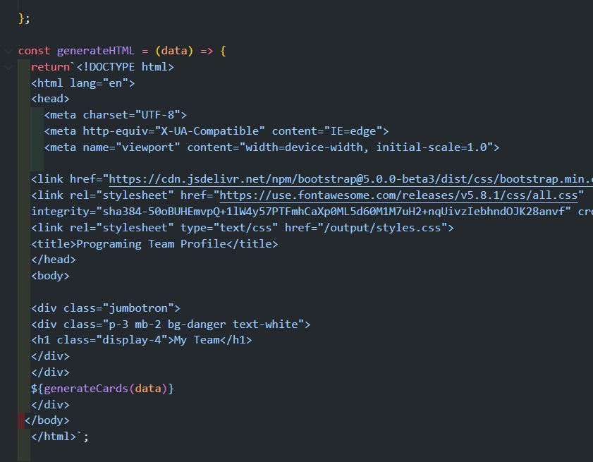
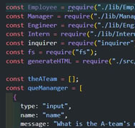
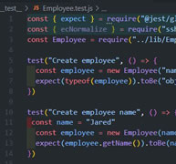
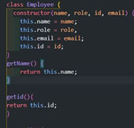
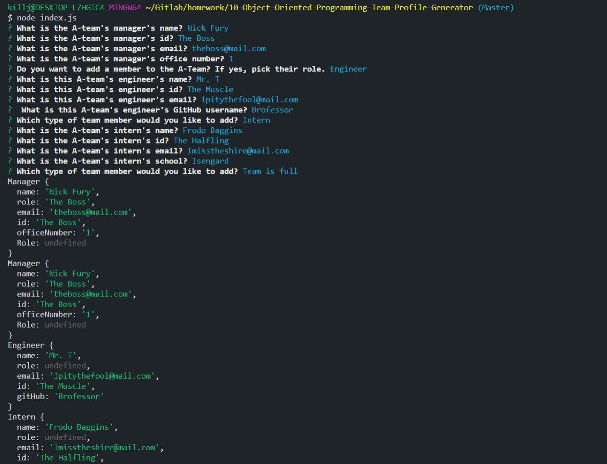

# 10-Object-Oriented-Programming-Team-Profile-Generator
## Introduction:
Our task was to create a command-line application. That dynamically generates a new html/css file from a user's input using the Inquirer package and jest to test.

I created a demo that you can view on this link:
 [Good README Generator Demo](https://drive.google.com/file/d/1BLbe6w9UIov3UzG22q1rq4g9ZKorqRxf/view?usp=sharing/)

<br>
<br>


## Technologies used:

* Java Script
* Iqurer
* Jest
* HTML
* CSS/Bootstrap


The application will be invoked by using the following command:
```bash
node index.js
```
<br>
<br>

### Original HTML/Bootstrap  Code


<br>
<br>

### Original Java Script  Code

<br>
<br>

### Screenshot of Tests

<br>
<br>

### Screenshot of Classes

<br>
<br>

### Screenshot of Terminal

<br>
<br>

### Demo of Team Generator


<br>
<br>
<br>
<br>

[](https://opensource.org/licenses/MIT)


